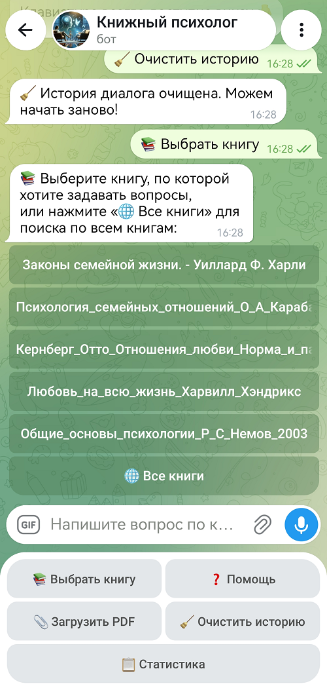
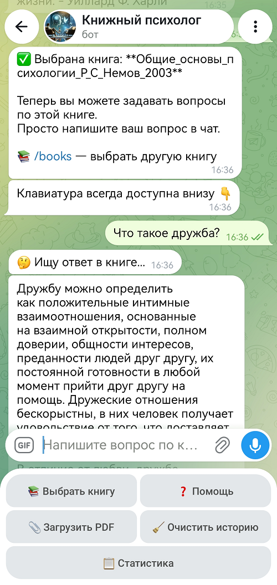
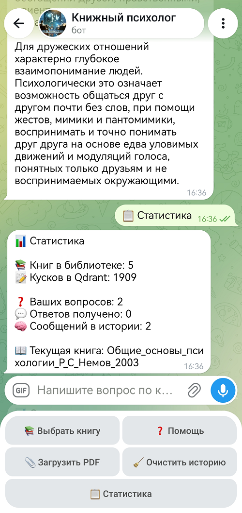
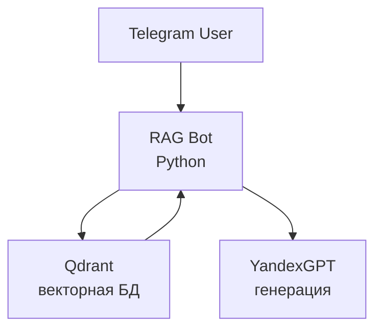

# 🧠 RAG-бот по психологии

[](https://www.python.org/)
[](https://www.docker.com/)
[](https://qdrant.tech/)
[](https://cloud.yandex.ru/)
[](LICENSE)

Telegram-бот, который отвечает на вопросы по книгам по психологии, используя **RAG** (Retrieval-Augmented Generation).

Бот ищет ответы **не по ключевым словам**, а **по смыслу** — с помощью векторного поиска в Qdrant и генерации через YandexGPT.

---

## 📸 Демо

| Выбор книги | Ответ на вопрос | Статистика |
|-------------|-----------------|------------|
|  |  |  |

---

## ✨ Возможности

- 📚 **Загрузка PDF-книг** — бот читает, режет на куски, индексирует в Qdrant
- 🔍 **Семантический поиск** — ищет по смыслу, а не по словам
- 🤖 **Генерация ответов** — через YandexGPT на основе найденных кусков
- 💬 **История диалога** — бот помнит контекст беседы
- 🌐 **Поиск по всем книгам** — или по конкретной
- 📎 **Загрузка книг через Telegram** — без перезапуска
- 📊 **Статистика** — сколько книг, кусков, вопросов
- 🎛️ **Постоянная клавиатура** — кнопки всегда под рукой

---

## 🛠️ Технологии

| Компонент | Технология |
|-----------|-----------|
| **Язык** | Python 3.11 |
| **Контейнеризация** | Docker, Docker Compose |
| **Векторная БД** | Qdrant |
| **Эмбеддинги** | FastEmbed (`paraphrase-multilingual-MiniLM-L12-v2`) |
| **LLM** | YandexGPT (`yandexgpt-lite`) |
| **Telegram** | python-telegram-bot |
| **Нарезка текста** | LangChain Text Splitters |
| **Чтение PDF** | pypdf |

---

## 🏗️ Архитектура



**Как это работает:**

1. **Загрузка книги:** PDF → текст → нарезка на куски → эмбеддинги → Qdrant
2. **Вопрос:** текст → эмбеддинг → поиск в Qdrant → топ-5 кусков
3. **Ответ:** куски + вопрос → YandexGPT → готовый ответ

---

## 📁 Структура проекта
```
rag-bot/
├── bot/
│   ├── telegram_bot_psychology.py   # Основной код бота
│   ├── Dockerfile                   # Инструкция сборки образа
│   └── .dockerignore                # Исключения для Docker
├── docs/                            # Скриншоты для README
├── books/                           # PDF-книги (не в Git)
├── .env.example                     # Шаблон переменных окружения
├── .gitignore                       # Исключения для Git
├── docker-compose.yml               # Конфигурация контейнеров
├── restart.sh                       # Скрипт перезапуска
├── LICENSE                          # Лицензия MIT
└── README.md                        # Этот файл
```

---

## 🚀 Установка и запуск

### Требования

- Docker и Docker Compose
- VPN или прокси для доступа к Telegram (если в России)
- Минимум 4 ГБ RAM

### 1. Клонируй репозиторий

```bash
git clone https://github.com/Superstas87/rag-bot.git
cd rag-bot
```

### 2. Создай .env
```bash
cp .env.example .env
```
Открой .env и вставь свои токены:

- TELEGRAM_TOKEN — получить у @BotFather
- YA_API_KEY — получить в Yandex Cloud
- YA_FOLDER_ID — ID каталога в Yandex Cloud

### 3. Положи книги в папку books/
```bash
mkdir -p books
cp /путь/к/книгам/*.pdf books/
```

### 4. Запусти контейнеры
```bash
docker compose up -d
```
### 5. Проверь логи
```bash
docker logs -f rag-bot
```
### 6. Открой бота в Telegram
Найди своего бота и напиши /start.

## 📝 Команды бота

| Команда | Что делает |
|---------|-----------|
| `/start` | Приветствие и клавиатура |
| `/books` | Показать список книг |
| `/help` | Справка |
| `📚 Выбрать книгу` | Выбрать книгу для поиска |
| `📎 Загрузить PDF` | Загрузить новую книгу |
| `🧹 Очистить историю` | Сбросить историю диалога |
| `📋 Статистика` | Показать статистику |

## ⚙️ Переменные окружения

| Переменная | Обязательна | Описание |
|------------|:-----------:|----------|
| `TELEGRAM_TOKEN` | ✅ | Токен Telegram-бота |
| `YA_API_KEY` | ✅ | API-ключ YandexGPT |
| `YA_FOLDER_ID` | ✅ | ID каталога Yandex Cloud |
| `HTTP_PROXY` | ❌ | Прокси для Telegram (если нужен) |
| `HTTPS_PROXY` | ❌ | Прокси для Telegram (если нужен) |

## 🔧 Решение проблем

## Бот не отвечает
1. Проверь, работает ли прокси:
```bash
curl -x http://172.17.0.1:33993 https://api.telegram.org -I --max-time 15
```
2. Проверь логи:
```bash
docker logs --tail 50 rag-bot
```
3. Перезапусти бота:
```bash
docker compose restart bot
```

## Бот перестал отвечать через время
Это известная проблема с long polling в python-telegram-bot. Решения:
1. Увеличь таймауты (см. HTTPXRequest в коде).
2. Настрой systemd-таймер для автоперезапуска.

## 📄 Лицензия
Проект распространяется под лицензией MIT. Подробности в файле LICENSE.

## 👤 Автор
- Станислав — RAG-инженер
- GitHub: @Superstas87
- Telegram: @Superstas87

## 🙏 Благодарности
- Qdrant — векторная база данных
- Yandex Cloud — YandexGPT API
- python-telegram-bot — Telegram API
- FastEmbed — эмбеддинги